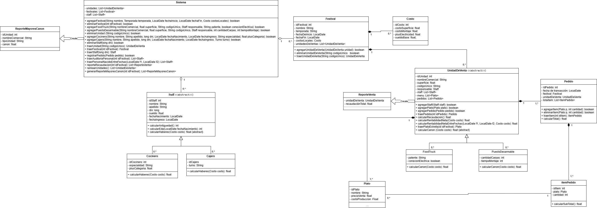

# Trabajo Práctico - Herencia y Polimorfismo en Java

Trabajo de desarrollado para la materia **Programación Orientada a Objetos I** de la **Universidad Nacional de Lanús (UNLa)**.

## Descripción

Este proyecto fue realizado en Java utilizando Eclipse IDE y tiene como objetivo aplicar conceptos fundamentales de la Programación Orientada a Objetos (POO).

Durante el desarrollo se trabajó con distintos mecanismos de reutilización y organización del código, aplicando principios como herencia, abstracción y polimorfismo, pilares fundamentales de la POO. La herencia permite crear nuevas clases a partir de otras existentes, favoreciendo la reutilización de código, mientras que el polimorfismo posibilita trabajar con diferentes objetos a través de una interfaz común.

## Conceptos aplicados

* Clases y objetos
* Encapsulamiento
* Herencia
* Polimorfismo
* Clases abstractas
* Sobreescritura de métodos
* Relaciones entre clases

## Estructura del proyecto

```text
src/
├── Modelo/   -> Clases principales del sistema
└── Test/     -> Clase principal para pruebas y ejecución
```

## Tecnologías utilizadas

* Java
* Eclipse IDE
* Git
* GitHub

## Objetivo académico

Desarrollar una solución aplicando los principios de la Programación Orientada a Objetos, reforzando conceptos de diseño, reutilización de código y modelado mediante clases y jerarquías de herencia.

## Autor

Nahuel Garcia
Estudiante de Licenciatura en Sistemas - UNLa

## Diagrama UML

El siguiente diagrama representa la estructura de clases y las relaciones principales del sistema, incluyendo herencia, clases abstractas y asociaciones entre entidades.



